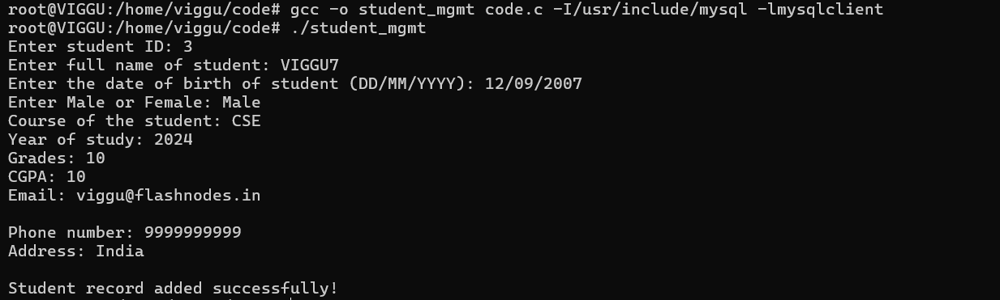
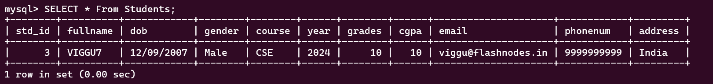

# Student Record System (C)

This is a simple Student Record Management System implemented in C, which interacts with a MySQL database to store student information.

## Features
- Add new student records to the database.
- Store information such as student ID, full name, date of birth, gender, course, year, grades, CGPA, email, phone number, and address.

## Prerequisites
Before running the program, ensure you have the following installed:
- **MySQL Server**: The system will use MySQL to store student records.
- **MySQL Client Libraries**: Make sure you have the MySQL client libraries and development headers installed to compile the C code with MySQL.
- **C Compiler**: Such as `gcc`.

### On Ubuntu/Debian:
```bash
sudo apt-get update
sudo apt-get install mysql-server libmysqlclient-dev gcc

---
```
# Mysql Setup

1.Create the **StudentDB** database and the **Students** table by running the following SQL commands:
```bash
CREATE DATABASE StudentDB;

USE StudentDB;

CREATE TABLE Students (
    std_id INT PRIMARY KEY,
    fullname VARCHAR(100),
    dob VARCHAR(15),
    gender VARCHAR(10),
    course VARCHAR(100),
    year INT,
    grades INT,
    cgpa FLOAT,
    email VARCHAR(100),
    phonenum BIGINT,
    address VARCHAR(100)
);
```
2.don't forget to modify the connection parameters.

----

# compilation

I've faced problems while compilation cuz mysql.h library wasn't installed i referred this https://dev.mysql.com/downloads/c-api/ and also i used chatgpt to fix the error as i am a new devoloper :p at last its succesfull :p;

use the following command for compilation
```bash
gcc -o student_mgmt code.c -I/usr/include/mysql -lmysqlclient
```
```bash
./student_mgmt
```
----
# sample output


